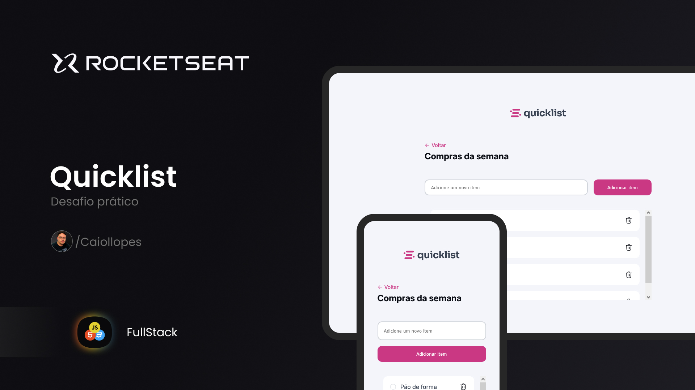

<h1 align="center"> Quicklist </h1>

 

  

## 💻 Projeto

Quicklist é um desafio prático para colocar em pratica o que aprendi e desenvolvi em aula.

## ⚙️ Funcionalidades

Neste projeto eu apliquei:

- Adicionar produto ao clicar no botão
- Excluir o item ao clicar na lixeira (retorna um alert de que aquele item foi removido)
- Selecionar produto
- Responsividade (Desktop / Mobile)

## 🚀 Tecnologias

Esse projeto foi desenvolvido com as seguintes tecnologias:

- HTML e CSS
- Git e Github
- Figma
- JavaScript

## 🔖 Web site

Você pode visualizar este projeto
<a href="https://caiollopes.github.io/quicklist-rks/">Clicando aqui!</a>
